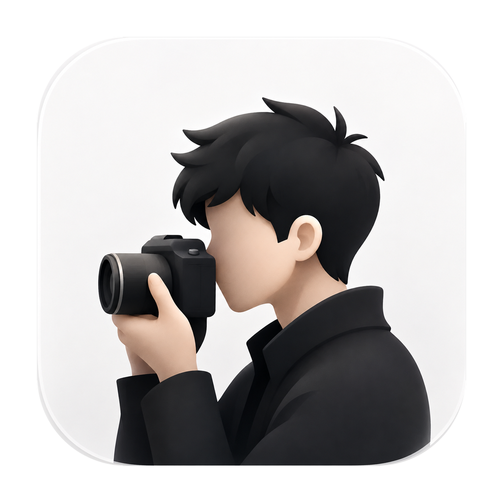
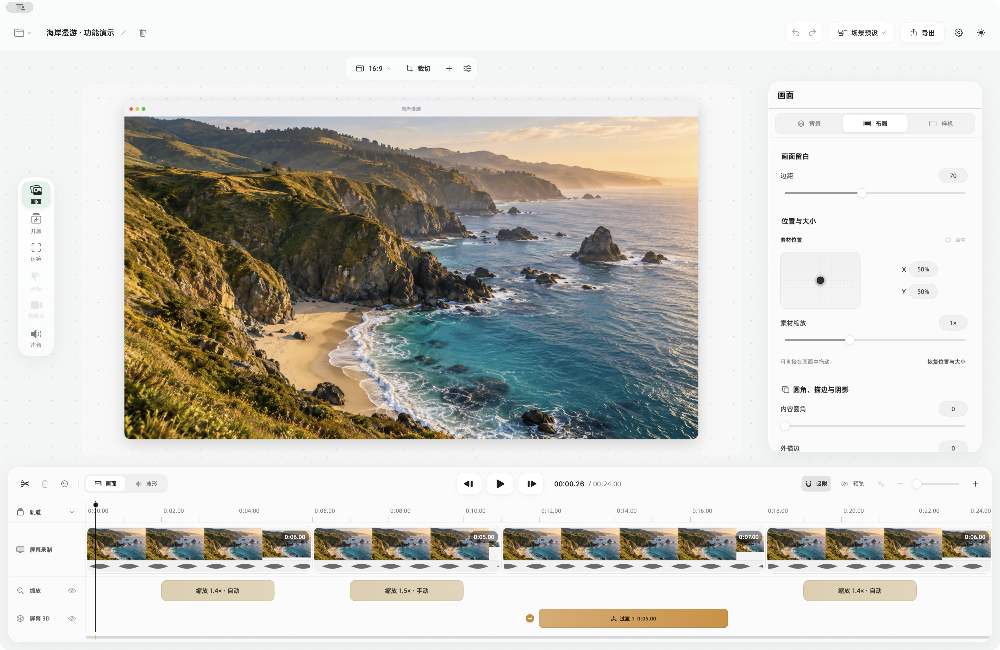
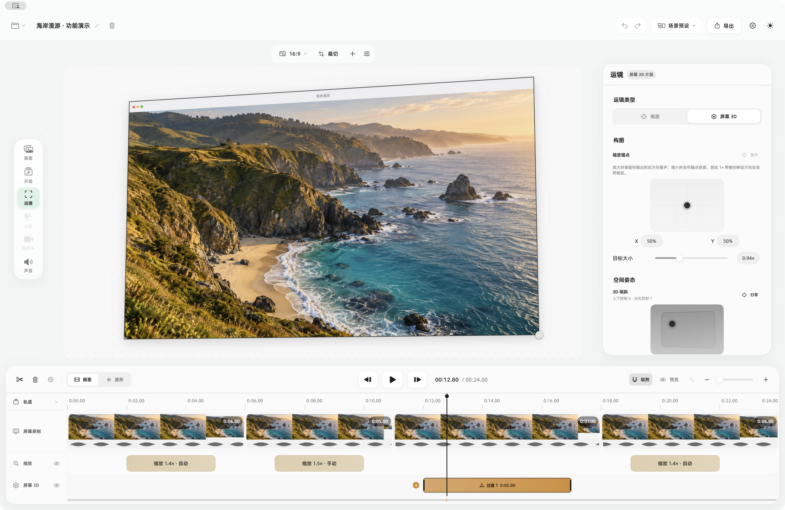
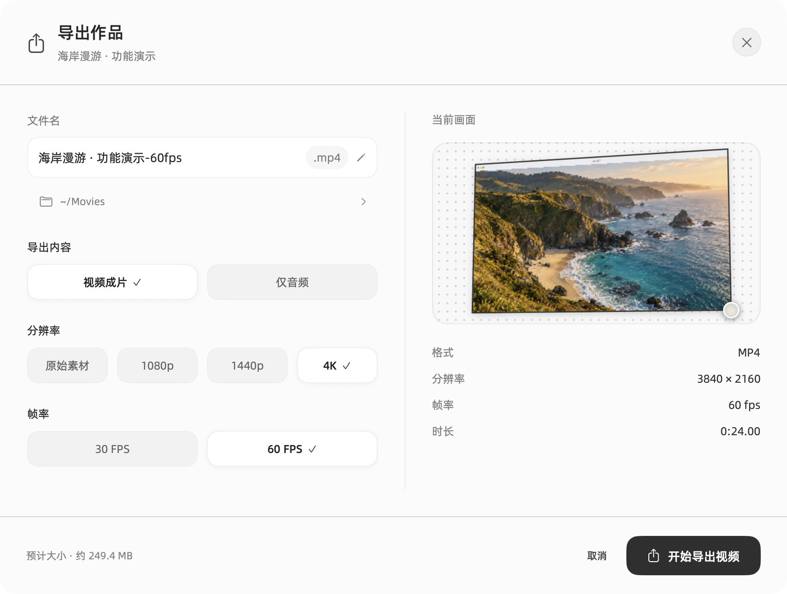

> [!IMPORTANT]
> **首次打开提示：** DogSC 目前通过 GitHub 分发，暂不计划在 App Store 付费上架。当前测试版使用 Apple Development 开发签名，尚未采用 Developer ID 分发签名并完成 Apple 公证。
>
> 下载 DMG 并将 DogSC 拖入「应用程序」后，如果 macOS 阻止打开，可在 **系统设置 → 隐私与安全性 → 仍要打开** 中允许。请确认文件来自本仓库的 [Releases](https://github.com/laogou717/dogsc/releases)，无需关闭系统安全保护。详见 [Apple 官方说明](https://support.apple.com/zh-cn/102445)。
>
> App Store 上架与签名、公证是不同的流程；App Store 之外的应用也可以使用 [Developer ID](https://developer.apple.com/developer-id/) 分发。

<p align="center">
  
</p>

<h1 align="center">DogSC</h1>

<p align="center">macOS 原生录屏与轻量编辑工具。录制、剪辑、运镜，到导出成片。</p>

<p align="center">
  <a href="https://github.com/laogou717/dogsc/releases/latest"><strong>下载 DogSC</strong></a>
  · <a href="#从源码构建">从源码构建</a>
  · <a href="https://github.com/laogou717/dogsc/issues">反馈问题</a>
</p>



## 录制


支持屏幕、窗口与区域录制，可同时录制摄像头、麦克风和系统声音。录制结束后，可以保存项目，或直接进入编辑。

录制时仍可打开以前已完成的项目编辑。编辑窗口可以正常录入画面；录制条和备忘录等辅助窗口只从当前录制进程的画面中排除。使用另一实例或其他录屏工具做显示器／区域录制时，可以录入本软件的录制条、备忘录与首次使用引导。

内置 **悬浮备忘录**，可独立拖动、调整大小、字号与背景不透明度。文稿自动保存在本机，重启后仍可使用；备忘录不会进入 DogSC 自身的录制画面。

录制时可点 **标记按钮**或按 **⌃⌥M** 留下剪辑书签，方便之后找回口误、重录或重点位置。标记随项目保存，不会进入成片。

## 编辑与运镜



- **时间线剪辑**：分割、裁短、重排、加速与恢复剪辑，支持缩略图／波形显示及边界吸附。
- **开场与运镜**：开场动效、自动跟随、手动缩放，以及可调整倾斜、透视和聚焦虚化的屏幕 3D；暂停调整手动缩放时可直接预览目标构图。
- **效果复用**：缩放、屏幕 3D、摄像运动、贴图和柔化片段可用 **⌘C / ⌘V** 复制、粘贴完整副本；优先放到鼠标所指的时间线位置，鼠标离开时间线则使用播放头；开启吸附后，贴近同类片段边缘可直接接上。**⌘⇧V** 向选中的同类组件粘贴属性，保留其位置和长度。
- **光标与摄像头**：单独控制光标样式、点击反馈、静止后隐藏或始终隐藏；可独立校准光标时间，不改变移动平滑参数；调整摄像头布局与动画。
- **画面设计**：比例、裁切、留白、圆角、阴影、背景与样机外框；支持贴图、画面柔化和场景预设。

## 导出

<p align="center">
  
</p>

支持 **MP4 视频**与 **M4A 音频**。视频可选原始素材分辨率、1080p、1440p、4K，以及 **30／60 FPS**。保留 `.dogscproject` 项目包，方便以后继续编辑。

导出时显示处理阶段与已用时间，速度稳定后提供预计剩余时间；可随时取消。

设置中的「关于」集中提供版本、软件更新、源码与反馈入口。软件免费使用；「请杯咖啡」可查看自愿支持的赞赏码，导出完成后也可打开。

## 使用说明

- **系统要求**：Apple Silicon Mac，macOS 14 或更高版本。
- **首次授权**：按引导开启屏幕录制与辅助功能权限；麦克风、摄像头按需授权。
- **预览性能**：测试版在完整分辨率、多效果叠加时仍可能掉帧，可降低预览质量，导出分辨率单独设置。
- **界面截图**：来自当前开发版，使用 AI 海岸风景演示素材，无个人录制内容。README 对应当前源码，已下载版本请参照其发布说明。

## 从源码构建

需要 Apple Silicon Mac、**Xcode 26 或更新版本、Swift 6**，以及自己的 **Apple Development 签名证书**。无需作者的私钥或 GitHub Secrets。

<details>
<summary>查看构建命令与开发版说明</summary>

```bash
git clone https://github.com/laogou717/dogsc.git
cd dogsc

# 查看本机可用的签名证书
security find-identity -v -p codesigning

# 构建完整开发版 App
DOGSC_SIGNING_IDENTITY="你的 Apple Development 证书的 40 位 SHA-1 指纹" bash build-app.sh
open ".build/local/DogSC Dev.app"
```

可在 Xcode 的 Accounts → Manage Certificates 中创建自己的 Apple Development 证书，私钥保留在本机钥匙串。首次构建需要联网下载已锁定的 Sparkle 依赖。

脚本进行 Release 构建，组装图标、字体、本地化资源与 Sparkle，并签署完整 App。仅运行 `swift build -c release` 只编译可执行文件，不生成完整 `.app`。

产物为 **`.build/local/DogSC Dev.app`**（`cn.laogou.dogsc.dev`）。它与下载的 **DogSC**（`cn.laogou.dogsc`）使用独立偏好和系统权限，授权时请区分名称；开发版不连接正式版更新源。

默认使用 `/Applications/Xcode.app`；其他安装位置可通过 `DEVELOPER_DIR` 指向对应的 `Xcode.app/Contents/Developer`。重新构建前请保存并退出正在运行的 DogSC。

源码包含录制、编辑实现与必要运行资源。系统壁纸、用户录制与项目文件不随源码分发；制作正式 DMG 与签名更新源所需的发布证书和 Sparkle 密钥由维护者单独配置。

</details>

## 许可

源代码采用 [MIT License](LICENSE)。随附字体采用其自身的许可，详见 [字体说明](Resources/Fonts/README.md) 与 [许可原文](Resources/Fonts/LICENSE.txt)。
